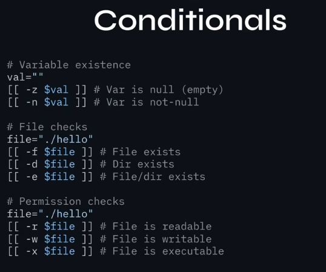

# Create simple shell scripts ✅
- Detailed bash scripting notes can be found [here](https://github.com/nanoenjoyer/bash_scripting)

## Conditionally execute code (use of: if, test, [], etc.) ✅
- `test` and `[ ]` are literally the exact same tool under the hood, `[[ ]]` is the newer smarter version of `[ ]` so make sure to use `[[ ]]` in the exam.
- In Bash, spaces are actually syntax. If you bunch things together, the script will crash. Always leave a space after the opening bracket/parenthesis and a space before the closing one.
    - Wrong Syntx:    if [[$NAME=="root"]]
    - Correct Syntax: if [[ $NAME == "root" ]]
- Memorize These 4 File Flags:
`-e` -> If `any` file or folder exists -> [[ -e /etc/hosts ]]
`-f` -> If it exists and is a `regular file` -> [[ -f /etc/passwd ]]
`-d` -> If it exists and is a `directory` -> [[ -d /var/log ]]
`-s` -> If a `file` exists and is `not empty` (size > 0) -> [[ -s /tmp/output.txt ]]

- Check if a variable is empty
`-z` "$name" -> `True` if the variable 'name' is empty

- Exam style:
```bash
#!/bin/bash

# Check if a directory exists using [[ ]]
if [[ -d /backup ]]; then
    echo "Backup directory is already there."
else
    mkdir /backup
fi

# Check a numerical argument using (( ))
if (( $1 > 5 )); then
    echo "The argument is greater than 5."
fi

# check if a file exists and is not empty (has size greater than 0),
# then empty it if it's not empty already.
if [[ -s file.txt ]]; then
    echo "file.txt is not empty, clearing it..."
    # this wipes the file and makes it's size exactly zero
    # : is the do nothing command, followed by a redirection.
    :> file.txt
    echo "file.txt has been cleared."
else
    echo "file.txt is empty."
fi
```

for more notes, refer to [this](https://github.com/nanoenjoyer/bash_scripting/blob/main/if_statements_and_math_operators.sh)

## Use Looping constructs (for, etc.) to process file, command line input ✅
- process a file line-by-line
```bash
# assuming '/root/users_list.txt' exists
for user in $(cat /root/users_list.txt); do
    useradd "$user"
done
```
- for more notes on loops, refer to [for-loops](https://github.com/nanoenjoyer/bash_scripting/blob/main/arrays_and_for-loops.sh) and [while-loops](https://github.com/nanoenjoyer/bash_scripting/blob/main/while-loops.sh)

## Process script inputs ($1, $2, etc.) ✅
- `$#` gives you the total number of arguments passed (great for validation).
```bash
# Example: A script that takes a username ($1) and a directory ($2)
# Usage: ./myscript.sh ibrahim /backups

if [ $# -lt 2 ]; then
    echo "Usage: $0 <username> <directory>"
    exit 1
fi

useradd "$1"
mkdir -p "$2"
chown "$1":"$1" "$2"
```
- refer to [this](https://github.com/nanoenjoyer/bash_scripting/blob/main/functions.sh) for more notes on script inputs

## Processing output of shell commands within a script ✅
- You will frequently need to capture the output of a standard Linux command and save it into a variable to use later in your script.
    - Modern Syntax: `VARIABLE=$(command)`
```bash
# Example: Check disk usage percentage of the root partition
# If it's over 80%, print a warning.

DISK_USAGE=$(df / | awk 'NR==2 {print $5}' | tr -d '%')

if [ "$DISK_USAGE" -gt 80 ]; then
    echo "Warning: Disk usage is critically high at ${DISK_USAGE}%"
fi
```

---

# Putting It All Together
Imagine an exam question asks you to create a script named `/root/batch_users.sh`. It must accept a filename as its first argument. The file contains a list of usernames. The script must loop through the file, check if the user already exists, and if they don't, create them.
```bash
#!/bin/bash

# Validate script input
if [ -z "$1" ]; then
    echo "Error: Please provide a filename."
    exit 1
fi

# Process command output to check if file exists
if [ ! -f "$1" ]; then
    echo "Error: File $1 not found."
    exit 1
fi

# Loop through the file
for USER in $(cat "$1"); do

    # Process output of 'id' command to see if user exists
    # but send output to /dev/null
    id "$USER" &> /dev/null

    # '$?' checks the status code of the prev command, 0 is success
    # anything else is failure
    if [ $? -eq 0 ]; then
        echo "User $USER already exists. Skipping."
    else
        echo "Creating user: $USER"
        useradd "$USER"
    fi
done
```