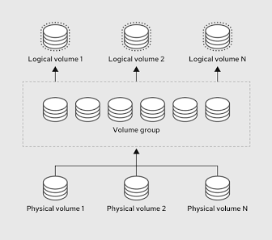

# Configure local storage


## List, create, and delete partitions on GPT disks ✅
### list partitions
to list all available disks and their partitions, run:
```bash
sudo fdisk -l
```
> This command displays detailed information for every disk. Near the top of each disk's section, look for Disklabel type. If it says gpt, it's a GPT disk.
- a simpler way to show disks and their partitions is running `lsblk`

### create a partition (the interactive flow)
First get an extra disk to create a partition on, in the exam you will have a secondary disk that you can do tasks on, but for practice on your own machine you have to create a disk in the vm you are practicing on, if you are using `virt-manager`, do this to create an extra disk:

- open the VM details windown and click on the **Lightbulb icon** (show virtual hardware details)
- click **add hardware** at the bottom left.
- select **storage**, set the size to 5GiB, and ensure the Device type is set to **Disk Device** and Bus type st to **VirtIO** (this ensures it shows up as `vdb` or `sdb` depending on the storage naming)
- click **Finish** and start the VM.
- once the VM loads, type `lsblk` to verify

if you are using VirtualBox:
- Select the RHEL VM and click **Settings** -> **Storage**.
- Click the **Add Hard Disk** icon next to the Controller (SATA or SCSI).
- Choose **Create**, select **VDI**, pick **Dynamically allocated**, and set the size to `5 GB`.
- Click **Choose/OK** and start the VM.
- once the VM loads, type `lsblk` to verify
> You should now see an unmounted, completely raw `vdb` or `sdb` listed right under `vda/sdb` with a size of 5G.

Now to create a partition from the new disk, lets say it's a `vdb`, run the partition editor:
```bash
sudo fdisk /dev/vdb
```
> This opens an interactive shell. It will not write changes to the disk until you save

Once inside `fdisk`, use these shortcuts:
- type `m` and hit `enter` -> for help, shows all shorcuts and what they do
- `g` and `enter` -> create a GPT label (this initializes the disk as a GPT disk), you skip this part if you are creating a second partition because you already set the disk to be GPT if you did `g` for the first partition.
- `n` -> create a new partition
- when asked for partition number, hit `enter` to accept default (usually 1)
- first sector, hit `enter` to accept default
- last sector (this is where you set the size), to make a `2GB` partition, type `+2G` and hit `enter`
- change the type (crucial for LVM), by default, it creates a standard Linux filesystem. If you want to use it for LVM later, type `t`, then type `30` (which is the code for Linux LVM in GPT), and hit `enter`
- save and exit by typing `w` and hitting `enter`
- after partitioning the disk, the kernal might not instantly see the new partition. Always run this command to force the OS to reload the partition table:
```bash
sudo udevadm settle
```

### delete a partition
- open the disk partition editor
```bash
sudo fdisk /dev/vdb
```
- type `d` (delete), if there are multiple partitions it'll ask you which number to delete, type the number (e.g 1) and hit `enter`
- type `w` to write the changes and exit
- reload the partition table
```bash
sudo udevadm settle
```

## Create and remove physical volumes ✅
A Physical Volume is simply a raw block device (either a whole disk like `/dev/vdb` or a partition like `/dev/vdb1`) that has been initialized so LVM knows it can write metadata and data to it.
### create a physical volume (PV)
You can turn a whole raw disk or a specific partition into a Physical Volume. On the exam, read the instructions carefully, they might specify using the **whole disk** (e.g., `/dev/vdb`) or **a specific partition** (e.g., `/dev/vdb1`).
- initialize a raw disk/partition
```bash
sudo pvcreate /dev/vdb
```
> Note: if you created a partition first, use `/dev/vdb1` instead

If you use the `pvcreate` command on a whole disk instead of a partition, and the disk previously had a partition table or filesystem on it, `pvcreate` will warn you that it found an existing signature and ask if you want to wipe it. Type `y` (yes) to confirm.
### list and verify PVs
There's 3 diff ways to do this:
1. physical volume summary, this gives you a clean, one-line-per-device summary showing the PV name, its VG (if assigned), size, and free space.
```bash
sudo pvs
```
2. physical volume scan, scans all supported LVM block devices on the system and lists them.
```bash
sudo pvscan
```
3. physical volume display, shows detailed attributes, such as UUID, exact physical extent (PE) size, and total extents.
```bash
# if you created the PV from a partition
sudo pvdisplay /dev/vdb1
```
### remove a physical volume
If you make a mistake or the exam asks you to destroy/rebuild storage, you can safely remove the LVM signature from the device.
```bash
# if you created the PV from a partition
sudo pvremove /dev/vdb1
```
> ⚠️ The Safety Catch: LVM will not let you remove a PV if it is currently assigned to an active Volume Group (VG) that is holding active Logical Volumes. You must destroy the Logical Volumes and Volume Groups first (which we'll cover next) before you can run `pvremove`.

## Assign physical volumes to volume groups ✅
Think of a VG as a big virtual hard drive built out of one or more PVs.
### create a VG (Volume Group)
```bash
sudo vgcreate <vg_name> <pv_device>
```
> e.g `sudo vgcreate demo_vg /dev/vdb1`

- On the RHCSA exam, they will sometimes add a specific requirement like "Create a volume group with a Physical Extent (PE) size of **16 MiB**." (Physical Extent is the smallest, fixed-size contiguous chunk of disk space that can be allocated), if you do not specify this, LVM defaults to 4 MiB. To set a custom PE size, use the `-s` option:
```bash
sudo vgcreate -s 16M demo_vg /dev/vdb1
```
### list and verify  VGs
- `sudo vgs` for a quick summary (recommended)
- `sudo vgscan`
- `sudo vgdisplay demo_vg` for detailed info including PE size
### extend and existing VG
If the Volume Group is running out of space, and the exam asks you to add another disk/partition to it? You don't have to rebuild it. You simply "extend" it.

If you have a second partition ready (e.g `/dev/vdb2`):
```bash
# init the new storage
sudo pvcreate /dev/vdb2

# add it to the existing pool
sudo vgextend demo_vg /dev/vdb2
```
> Now, if you run `sudo vgs`, you will see the demo_vg pool has grown by the size of `/dev/vdb2`
### remove a VG
```bash
sudo vgremove demo_vg
```
> Note: you cannot remove a VG if it has active Logical Volumes inside it

## Create and delete logical volumes ✅
Now that we have a Volume Group perfectly set up and extended, we can carve it up into Logical Volumes (LVs).

An LV is the equivalent of a standard partition, but with all the flexibility of LVM (like online resizing). This is the actual block device that you will format with a filesystem and mount to your system.
### create an LV
On the exam, you will usually be asked to create an LV with a specific size (e.g., 2 Gigabytes) or based on Extents (PEs).
- create a Logical Volume by size
To create a Logical Volume named `demo_lv` with a size of **2 Gigabytes** inside `demo_vg`:
```bash
# -L for size (use G for GB and M for MB),
# -n for name, and demo_vg is the parent VG you are carving the space from
sudo lvcreate -L 2G -n demo_lv demo_vg
```
You can create an LV in a specific PV
```bash
sudo lvcreate -L 1.5G -n demo_lv demo_vg /dev/vdb2
```
- create a Logical Volume by extents
Sometimes the exam will explicitly ask you to create a volume using a number of extents (each extent is 4MB by default unless you created the VG with a diff PE size) or a percentage of free space in the VG.
```bash
# create an LV using exactly 50 PE
sudo lvcreate -l 50 -n demo_lv demo_vg

# create an LV using 100% of the remaining free space in the VG
sudo lvcreate -l 100%FREE -n demo_lv demo_vg
```
> You can make both of the above commands target a specific PV by appending `/dev/<PV_name>`
### list and verify LVs
- `sudo lvs` for a quick summary
- `sudo lvdisplay /dev/demo_vg/demo_lv` for detailed info
### delete a Logical Volume
- First unmount it if it's mounted
```bash
sudo umount /path/to/mountpoint
```
- Remove the LV
```bash
sudo lvremove /dev/demo_vg/demo_lv

# remove all LVs under a VG
sudo lvremove /dev/demo_vg/*
```
> LVM will ask you to confirm with `y/n` because this permanently destroys any data on that volume

## Configure systems to mount file systems at boot by universally unique ID (UUID) or label ✅
Using `/dev/vdb1` or `/dev/demo_vg/demo_lv` in your mount configuration is risky. If you add or remove virtual storage controllers, your Linux kernel might rename `/dev/vdb1` to `/dev/vdc1` on the next boot, causing mount errors.
- A UUID is a permanent identifier tied directly to the filesystem itself. It will not change, even if you move the drive to a completely different SATA port or controller.

- Stick to practicing and mounting by UUID always instead of Label, as UUID is the safest and industry-standard way to do this.

- configure a persistent boot mount for `demo_lv` (from the `demo_vg` volume group) using it's UUID, follow the steps below:
1. format the LV with a filesystem
before a device can have a UUID, it must be formatted with either `xfs` (the RHEL default) or `ext4`
```bash
# if exam asks you to use 'ext4', substitute 'mkfs.xfs' with
# 'mkfs.ext4'
sudo mkfs.xfs /dev/demo_vg/demo_lv
```

2. retrieve the UUID
run `blkid` command to find the UUID of your formatted volume
```bash
sudo blkid /dev/demo_vg/demo_lv
```
> You'll see something like: /dev/demo_vg/demo_lv: UUID="a1b2c3d4-e5f6-7a8b-9c0d-e1f2a3b4c5d6" TYPE="xfs"

Copy the UUID inside the quotes (without the quotation marks)

3. create the mount point
create the target dir where the storage should appear
```bash
sudo mkdir -p /mnt/data
```
4. configure `/etc/fstab`
open the system mounting configuration file using a text editor
```bash
sudo vi /etc/fstab
```
> Or use `nano`

Append a new line at the bottom using this exact format
```bash
# if you formatted the volume as 'ext4', in column 3 type ext4
UUID=a1b2c3d4-e5f6-7a8b-9c0d-e1f2a3b4c5d6  /mnt/data  xfs  defaults  0 0
```
- Column 1: `UUID=<your-copied-uuid>` (No spaces around the =)
- Column 2: `/mnt/data` (The mount target)
- Column 3: `xfs` (Matches the filesystem format you used in Step 1)
- Column 4: `defaults` (Standard mounting options)
- Column 5: `0` (Dump utility configuration)
- Column 6: `0` (Filesystem check order)
5. test the configuration (crucial)
Do not reboot the machine yet! If there is a single typo in your `/etc/fstab` configuration, the system will crash into emergency mode on reboot.

Run this command after saving `/etc/fstab`
```bash
sudo mount -a
```
- If it runs silently and returns no output: Your configuration is perfect! The system successfully read /etc/fstab and mounted the drive.
- If it returns any warning or error: You have a typo. Correct the error inside `/etc/fstab` immediately and run `sudo mount -a` again until it is completely silent.
6. verify the mount
```bash
df -h | grep data
# or
findmnt /mnt/data
```

## Add new partitions and logical volumes, and swap to a system non-destructively ✅
Red Hat will test your ability to add resources (like new partitions, LVs, and swap space) to an active system without rebooting it or corrupting any existing data—which is exactly what "non-destructively" means.
- add a partition non-destructively
This is already done in the first sub-objective in this configure local storage objective, but when you add a new partition to an active disk (like `/dev/vdb`) while the system is running, the kernel might not automatically see it because the partition table is "busy."

If you run `lsblk` and your new partition (e.g., `/dev/vdb3`) doesn't show up, **do not reboot!** Instead, use these commands to force the kernel to safely scan and update its partition table:
```bash
# tells the kernel to reread the partition table
sudo partprobe
# tells the kernel to reread the partition table for a specific disk
sudo partprobe /dev/vdb
```
if `partprobe` doesn't work or throws an error, you can use the alt *udev* tool:
```bash
sudo udevadm settle
```
> After running `partprobe`, run `lsblk` again, your new partition will be ready to format, zero reboots required.

- add a new LV non-destructively
this is done in the create LVs sub-objective. Because LVM is designed for live systems, creating a new LV is inherently non-destructive.

The key is to verify the `/etc/fstab` config with `sudo mount -a`, after formatting and mounting the LV.

- add swap space non-destructively
    - You might be asked to add a specific amount of Swap space (e.g., 512 MB or 1 GB) using either a raw partition or a Logical Volume.

        You can use one of the LVs created for practice, creating swap from LV instead of raw partition is the most common way on modern RHEL systems. If the system already had swap and it's active, you can still make another one, it'll just be added to it.
    - Instead of `mkfs`, swap space has its own special formatting command:
        ```bash
        # if you have a logical volume named 'lv_swap'
        sudo mkswap /dev/demo_vg/lv_swap
        ```
    - Activate the swap space immediately (live)
        ```bash
        sudo swapon /dev/demo_vg/lv_swap
        ```
    - verify it's active
        ```bash
        swapon --show
        ```
        You can also use `free -m` to see your total configured memory and swap.
    - make it persistent in `/etc/fstab`

        To make sure this swap space turns back on automatically at boot, copy the UUID you got from `mkswap` (or grab it using `sudo blkid /dev/demo_vg/lv_swap`) and append it to `/etc/fstab`:
        ```bash
        sudo vi /etc/fstab
        ```
        At the bottom add:
        ```bash
        UUID=<swap-uuid> none swap defaults 0 0
        ```
        > Note: Swap doesn't have a folder mount point, so we use `none` in the second column, and its filesystem type in the third column is `swap`.
    - test the config

        To safely test the new swap without rebooting, first turn off the swap space you just enabled
        ```bash
        sudo swapoff /dev/demo_vg/lv_swap
        ```
        Run the persistent swap-mount command
        ```bash
        sudo swapon -a
        ```
        > This reads `/etc/fstab` and mounts/activates all swap devices listed inside
    - run `swapon --show` again, if new swap is active, the config worked.
