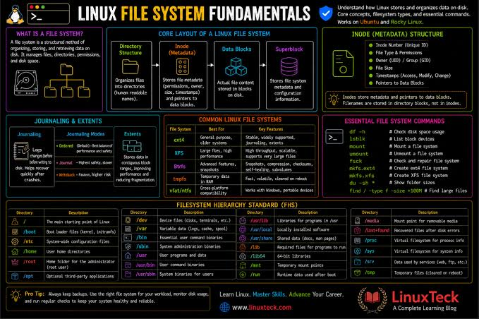

# Create and configure file systems ✅


## Create, mount, unmount, and use VFAT, ext4, and XFS file systems ✅
Before formatting, it's good to understand the diff between these file system types:
- **XFS**: The default file system for RHEL. Highly scalable, excellent for large data sets, but note that it **cannot be shrunk** natively (only grown).
- **ext4**: The traditional Linux workhorse. Standard journaling file system that supports both growing and shrinking.
- VFAT: Essentially FAT32. Zero support for Linux permissions, but used for cross-platform compatibility (like flash drives) and required for the EFI system partition.

To format the existing LVs (or raw partitions), `mkfs` (make file system) utility/command is used, assuming you have an LVM path like `/dev/demo_vg/demo_lv` or multiple, or a partition like `/dev/vdb1`
#### XFS
```bash
sudo mkfs.xfs /dev/demo_vg/demo_lv
```
#### ext4
```bash
# if you have a LV called 'ext4_lv'
sudo mkfs.ext4 /dev/demo_vg/ext4_lv
```
#### VFAT
- If you are missing `.vfat`, install the missing tools:
    - `sudo dnf install dosfstools -y` (this will give you access to more file system types)
    - `sudo dnf install autofs nfs-utils -y` (this will allow you to configure `autofs` and `nfs` for network file systems in later sub-objectives)
```bash
# if you have a LV called 'vfat_lv'
# -F 32: forces FAT32 which is standard
sudo mkfs.vfat -F 32 /dev/demo_vg/vfat_lv
```
#### create a mount point
```bash
sudo mkdir -p /mnt/data_xfs /mnt/data_ext4 /mnt/data_vfat
```
#### persistent mount
```bash
# open file system configs
sudo vi /etc/fstab

# get the UUID of LV devices inside vim, then copy the UUID in visual mode
# do this for the other 2 LVs, if you were told to create 3 mounts
:r !sudo blkid /dev/demo_vg/demo_lv

# the format inside the file is like this:
# 1st coloumn is device/UUID, 2nd: mount point, 3rd: fstype, 4th: options
# 5th: dump, 6th: fsck, this 'fsck' column controls the File System Check (fsck)
# order when the machine boots up or recovers from an unexpected crash
# (like a sudden power loss). 0 means skip (The system completely ignores
# the drive at boot. If the file system gets corrupted due to a sudden
# crash, the OS won't try to fix it automatically.)
# 1 means highest priority (eserved exclusively for the root file system
# (/). The OS must check and repair the root drive first before it can do
# anything else.)
# 2 means secondary priority (Used for any other non-root, standard Linux
# file systems (like ext4) that you want checked and safely repaired
# automatically if the system ever shuts down dirty.)
# the reason why xfs uses 0 but ext4 prefers 2 is: If an XFS system crashes,
# it repairs itself during the actual mount process. Therefore,
# XFS always gets a 0 in fstab. However ext4 relies on boot checks, traditional
# fsck utilities to scan and fix corrupted blocks if a dirty unmount happens.
# Setting it to 2 ensures that if the VM crashes, the system will automatically
# fix any corrupted files before mounting it, protecting the data.
# it's best practice but leaving it at 0 is fine and won't break the system.
UUID=<xfs-uuid>     /mnt/data_xfs    xfs    defaults  0 0
UUID=<ext4-uuid>    /mnt/data_ext4   ext4   defaults  0 2
UUID=<vfat-uuid>    /mnt/data_vfat   vfat   defaults  0 0
```
#### test the fstab (crucial)
Never reboot without testing this command first. If you made a typo in fstab, the VM might drop into an emergency boot shell.
```bash
sudo mount -a
```
Once mounted, you can test reading and writing. Keep in mind that a freshly formatted file system is owned by `root`.

Use `findmnt` command to get info about the mounted file system like it's fstype
```bash
findmnt /mnt/data_ext4
```
You'll see something like:
```bash
TARGET         SOURCE                      FSTYPE OPTIONS
/mnt/ext4-data /dev/mapper/demo_vg-ext4_lv ext4   rw,relatime,seclabel
```

## Mount and unmount network file systems using NFS ✅
Network File System (NFS) allows two machines to share a folder and be synced.

To practice for this task, you require two VMs, one to host an NFS server (a machine that takes a local directory on its hard drive (like /var/share) and "exports" it over the local network) and one to be the NFS client server (connects to that network share and hooks it into its own directory tree), on the exam the NFS server will be already setup, you'll be on the client and you have to mount it.

Once mounted, users on the client VM can read and write files inside that folder as if it were a physical drive plugged directly into their own machine, but the data is actually traveling across the network and saving onto the server's disk.

#### setup the host server (will be already there on the exam)
- on the host server, install `nfs-utils`
```bash
sudo dnf install nfs-utils -y
```
- create a dir and give it open permissions so the client VM/Machine won't get blocked by ownership issues
```bash
sudo mkdir -p /var/nfs_share
sudo chmod 777 /var/nfs_share
```
- export the dir
Open the config file `/etc/exports` using `sudo vi /etc/exports` and add a line telling the server what to share and who is allowed to access it:
```Plaintext
/var/nfs_share    *(rw,sync,no_root_squash)
```
> `*` means any machine on the local network can try to connect, `rw` gives read/write perms, and `sync` ensures data changes are written immediately to the disk.
- start and enable the service
```bash
sudo systemctl enable --now nfs-server
```
> if you change `/etc/exports` later, you can apply changes without restarting by running `sudo exportfs -r`
- open the firewall
RHEL has an active firewall by default. You need to let NFS traffic through so the client VM can talk to it:
```bash
# nfs traffic
sudo firewall-cmd --permanent --add-service=nfs
# legacy tools like showmount talk to two secondary services:
# rpcbind (port 111) and mountd. Allowing just nfs through the
# firewall isn't enough for showmount to fetch the exports list.
sudo firewall-cmd --permanent --add-service=rpc-bind
sudo firewall-cmd --permanent --add-service=mountd
sudo firewall-cmd --reload
```
- make sure the NFS service is fully alive
Sometimes, if the firewall configuration or files change, the NFS processes need a quick kick to register properly with the RPC portmapper:
```bash
sudo systemctl restart nfs-server
```

#### setup the client server (what you'll do in exam)
- install the required package
```bash
sudo dnf install nfs-utils -y
```
- discover the remote shares (host server has to be running)
Before you can mount a network share, you have to know what the server is actually sharing. You will be given the server's hostname or IP address (e.g., `server.example.com`).
```bash
# the -e flag stands for "exports"
showmount -e server.example.com
```
Or
```bash
showmount -e <host-server-ip-address>
```
> You'll see something like:
```bash
Export list for <host-server-ip-address>:
/var/nsf_share *
```
- create a local mount point (where the remote files will live locally)
```bash
sudo mkdir -p /mnt/nfs_share
```
- mount the network share persistently (so it survives reboot)
```bash
# open /etc/fstab
sudo vi /etc/fstab

# append this line
# remote path                                           # local mount    # type   # options
<host-server-ip-address-Or-hostname>:/var/nfs_share     /mnt/nfs_share    nfs     defaults,_netdev     0 0
```
> `_netdev`: tells RHEL "do not attempt to mount this share until the network interface is fully up and running", without this, the VM might crash or hang at boot trying to find a server it can't network to yet. `rw` or `ro`: the exam prompt might explicitly specify "mount the share as read-only", if it does, change the options column to `defaults,_netdev,ro`.
- test it safely
```bash
sudo mount -a
```

## Configure autofs ✅
Unlike the static `/etc/fstab` mounts can hang the machine when a server is down, `autofs` mounts network shares on demand (the moment you try to access the folder) and unmounts them automatically when they sit idle.

The below tasks are only done in client server, which is what you'll use on the exam

- install and start the service
```bash
sudo dnf install autofs -y
```
```bash
sudo systemctl enable --now autofs
```

- how does `autofs` work?
`autofs` uses tow main files to map remote shares to local folders:
1. master map file (`/etc/auto.master.d/nfs.autofs`): this defines the parent dir where mounts will live and points to a secondary map file.
2. secondary map file (`/etc/auto.nfs`): this defines the sub-dir name, mount options, and the remote NFS path.

- create master map entry
```bash
sudo mkdir -p /mnt/autoshare
```
```bash
sudo vi /etc/auto.master.d/nfs.autofs
```
Add this line:
```Plaintext
/mnt/autoshare   /etc/auto.nfs   --timeout=60
```
> `/mnt/autoshare`: base dir (autofs manages this folder), `/etc/auto.nfs`: path to the secondary map file (we will create next), `--timeout=60`: (optional) unmounts the share after 60 seconds of inactivity.

- create the secondary map file
```bash
sudo vi /etc/auto.nfs
```
Add this line:
```Plaintext
public   -rw,soft,_netdev   <host-nfs-server-ip>:/var/nfs_share
```
> `public`: The sub-directory name created automatically inside `/mnt/auto_share/`, `-rw,soft,_netdev`: Options (prefixed with a dash `-`). Common flags: `rw` or `ro`, `soft` (prevents hangs if server drops), `fstype=nfs4`. `192.168.x.x:/var/nfs_share`: The NFS source.

- restart the service and test
```bash
sudo systemctl restart autofs
```

Now, if you run `ls /mnt/autoshare`, it might look empty at first. This is normal. To trigger the automount, access the sub-dir directly (this sub-dir `public` will be created on demand)
```bash
cd /mnt/autoshare/public
```
> once you run this, that `public` dir will be created automatically by `autofs` and you'll see shared files or dirs inside it if there are any.

## Extend existing logical volumes ✅
Extending an existing Logical Volume (LV) is to add space to a live volume without losing the data currently stored on it.

To do this successfully, you must remember that an LV is in two layers:
1. **The Block Device Layer**: The LVM container itself.
2. **The Filesystem Layer**: The XFS or Ext4 format sitting inside that container.

If you only extend the container, your operating system won't see the new space until you also stretch the filesystem to fill it!

While you can run separate commands to grow the LVM container and then grow the filesystem, there is a golden flag (-r or --resizefs) that does both at the exact same time safely and non-destructively.

- Extending to a specific total size
If you have an LV that is currently **2 GB** and the exam asks you to extend it to a total size of **4 GB**, use the uppercase `-L` flag:
```bash
# -L 4G: Tells LVM: "Make the final, absolute size of this volume 4 GB"
# -r: This automatically detects if the volume is XFS or Ext4, and safely
# expands the filesystem to match the new size online, while mounted!
sudo lvextend -L 4G -r /dev/demo_vg/demo_lv
```

- Adding an increment of space
If the exam asks you to add an additional **500 MB** to whatever its current size is, use a plus sign:
```bash
# if the LV was 2GB before, this will make it 2.5GB
sudo lvextend -L +500M -r /dev/demo_vg/demo_lv
```

- Extending by Extents (PEs)
If the exam asks you to extend a volume to a certain number of extents, or to grab all remaining space in the Volume Group, use the lowercase `-l` flag:
```bash
# Extend the volume to use all remaining free space in the Volume Group
sudo lvextend -l +100%FREE -r /dev/demo_vg/demo_lv
```

- Verify the Extension
After running your `lvextend` command, always verify your work with two specific tools to make sure both layers grew:
1. Check the LVM layer
```bash
sudo lvs
```
2. Check the Filesystem layer
```bash
df -h
```
> This checks if the mounted filesystem actually registered the new storage capacity and grew in size.

## Diagnose and correct file permission problems ✅
Permission issues in RHEL usually stem from **three distinct layers**:

1. Standard Linux Permissions (UGO / `chmod` / `chown`)
2. Special Permissions (SUID, SGID, Sticky Bit)
3. Access Control Lists (ACLs)


### Standard Linux Permissions (UGO)
Every file and directory has three permission targets: **User (u)**, **Group (g)**, and **Others (o)**.

#### Reading Permissions (`ls -l`)
```text
drwxr-xr--. 2 ibra devs 4096 Jul 22 10:00 project
││  │  │
││  │  └── Others: Read-only (r--)
││  └───── Group (devs): Read & Execute (r-x)
││  └────── User (ibra): Read, Write, Execute (rwx)
└───────── File type ('d' = directory, '-' = regular file)
```

#### The Diagnostic Commands
* **`ls -la /path/to/target`**: Check standard owner, group, and permission bits.
* **`id <username>`**: Check which groups a blocked user actually belongs to.

#### How to Fix
```bash
# Change ownership (User and Group)
sudo chown ibra:devs /path/to/file

# Change permissions (Octal mode)
sudo chmod 755 /path/to/dir   # rwxr-xr-x
sudo chmod 644 /path/to/file  # rw-r--r--

# Change permissions (Symbolic mode - safest for exam!)
sudo chmod g+w /path/to/file  # Add write to group
sudo chmod o-rwx /path/to/file # Strip all access from others
```

### Special Permissions (SGID, SUID, Sticky Bit)
Exam tasks frequently ask for collaborative group directories or restricted shared folders.

#### Set Group ID (SGID) on Directories
* **The Problem:** When users in a shared team folder create files, those files inherit the user's primary group instead of the team's group, breaking group access.
* **The Fix:** SGID forces all *new* files created inside a directory to inherit the **directory's group ownership**.

```bash
# Set SGID (Symbolic or Octal 2xxx)
sudo chmod g+s /shared/dev_dir
# OR
sudo chmod 2770 /shared/dev_dir

# Verification: 'ls -ld' will show an 's' in the group execute position:
# drwxrws---. 2 root devs 4096 ... /shared/dev_dir
```

#### Set User ID (SUID) on Files
When an executable file has SUID set, any user who runs that executable temporarily gains the privileges of the file's owner (which is almost always `root`) while that program is actively executing, rather than running with their own permissions.

SUID is designed specifically for binary executable files. On standard Linux systems (including RHEL), SUID on directories is ignored by the Linux kernel for security reasons. Setting SUID on a directory does nothing. SUID is also ignored on interpreted scripts (like Python or Bash scripts) by default in Linux to prevent privilege escalation vulnerabilities.
```bash
# SUID on an executable file (Symbolic)
sudo chmod u+s /path/to/binary

# SUID (Octal mode: 4xxx)
sudo chmod 4755 /path/to/binary

# Verification: 'ls -l' will show an 's' in the user execute slot:
# -rwsr-xr-x. 1 root root 68240 Jul 22 10:00 /usr/bin/passwd
```
> If you see a capital `S` instead of lowercase `s`, it means SUID is set, but the owner didn't have execute (`x`) permissions enabled first

#### Sticky Bit
* **The Problem:** In a shared folder with write permissions for everyone (like `/tmp`), users can delete each other's files.
* **The Fix:** The Sticky Bit ensures **only the file owner (or root)** can delete or rename files inside that directory.

```bash
# Set Sticky Bit (Symbolic or Octal 1xxx)
sudo chmod +t /shared/public_dir
# OR
sudo chmod 1777 /shared/public_dir

# Verification: 'ls -ld' will show a 't' at the end:
# drwxrwxrwt. 2 root root 4096 ... /shared/public_dir
```

### Access Control Lists (ACLs)
Standard `ugo` permissions only allow **one owner** and **one group**. If the exam asks you to give a *specific secondary user* read access without changing group ownership, you **must use ACLs**.

#### How to Spot an ACL
Run `ls -l`. If you see a **plus sign (`+`)** at the end of the permissions string, an ACL is active:

```text
drwxr-xr--+ 2 root devs 4096 Jul 22 10:00 secret_data
```

#### Diagnose with `getfacl`
Never try to guess ACL issues with `ls`. Always inspect with `getfacl`, if the command is missing, install it with:
```bash
sudo dnf install acl -y
```
> this will allow you to use `getfacl` and `setfacl`

```bash
getfacl /path/to/file

# Display ACLs for all files in the current dir
getfacl -a .
```

*Output will clearly display specific user/group entries beyond standard UGO.*
#### Modify with `setfacl`

```bash
# Give user 'ibrahim' read/write access
sudo setfacl -m u:ibrahim:rw /path/to/file

# Give group 'auditors' read-only access
sudo setfacl -m g:auditors:r /path/to/file

# Set DEFAULT ACL on a directory (so ALL future/new sub-files inherit it)
sudo setfacl -m d:u:ibrahim:rw /shared/dir

# Remove a specific user ACL entry
sudo setfacl -x u:ibrahim /path/to/file

# Remove ALL custom ACLs (reset to standard permissions)
sudo setfacl -b /path/to/file

# Recurse into subdirectories
setfacl -R u:ibrahim:rx /data/reports
```

### Diagnostic Walkthrough (The Exam Troubleshooting Routine)
When a question states: *"User `ali` cannot write to `/data/reports`,"* follow this exact 3-step checklist:

1. **Check standard owner and group:**
```bash
ls -ld /data/reports
id ali
```

*Is ali the owner? Is ali in the group? Does the target bit have `w`?*
2. **Check for blocking ACLs:**
```bash
getfacl /data/reports
```

*Is there an explicit `u:ali:r--` or a mask blocking write access?*
3. **Check parent directory permissions:**
*Even if `/data/reports` has `777`, if `/data` is set to `700` and owned by `root`, user `ali` can't traverse into the folder!* Test parent paths with `ls -ld /data`.
